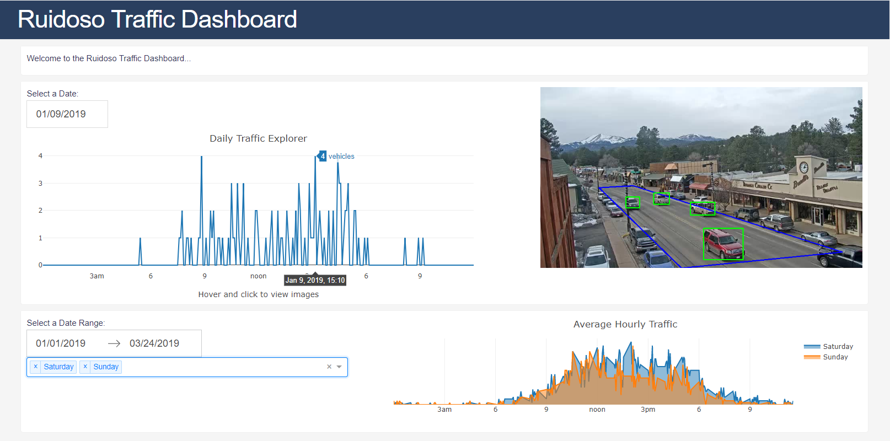

# Traffic Dashboard



Model training and data acquisition by Laurence Mirabal. Code can be found at [https://github.com/lmirabal8689/rgc](https://github.com/lmirabal8689/rgc)


## Getting Started

Requirements:
- Operating system: Ubuntu 18.04
- User account with sudo privileges
- Python 2 and 3
- Git

Login with a user with sudo privileges and execute the following to install python dependencies:

```
sudo apt update && sudo apt -y install python python-pip python3 python3-pip
sudo -H pip3 install pipenv --system
```


## Installation and Deployment with Ansible

The following steps will install Nginx, MariaDB and deploy the code in the `app` directory.

1. In the users home directory, clone this repository and go into the directory.

```
git clone https://github.com/jonahlyn/dashboard.git
cd dashboard
```

2. Go into the provisioner directory and execute the following to install the provisioner dependencies:

```
cd provisioner
pipenv install
```

3. Edit the `vars/main.yml` file and update the `server_name` variable with the fully qualified domain name of the server (or the IP address):

```
server_name: rgc1
```

4. Create the file `provisioner/vars/.vault_pass.txt` and add the vault password to it. (See also ["Changing Passwords"](#changing-passwords) in the troubleshooting section below.)

Make sure it has the right permissions.

```
chmod 600 vars/.vault_pass.txt
```

5. Execute the ansible playbook. When prompted, type in the user's sudo password. 

```
pipenv shell
ansible-playbook provisioner.yml -K
```

When provisioning is complete, the application will be running on port 80.

Example: http://rgc1


6. To allow external connection, open the port on the firewall.

```
sudo firewall-cmd --zone=public --permanent --add-service=http
sudo firewall-cmd --reload
```


## Troubleshooting and Maintenance

### Services

Start, stop, or check the status of nginx and the gunicorn system services:

```
sudo systemctl [start|stop|status] nginx
sudo systemctl [start|stop|status] gunicorn
sudo systemctl [start|stop|status] gunicorn.socket
```

Error messages can also appear here:

```
sudo journalctl -u gunicorn
```


### Application

Log files are located at:
  - access_log: `/var/log/nginx/access.log`
  - error_log: `/var/log/nginx/error.log`

Application log files are located in: `/var/www/dashapp/logs`


### Database

A user with sudo privileges can make a connection to the database using the mysql cli. Note: credentials can be found in `/root/.my.cnf`

1. Type `sudo su -` and enter the user's password.
2. Connect to mysql using the cli: `mysql -u root`


### Changing Passwords

1. Change the vault password in `vars/.vault_pass.txt`

For each password in `main.yml`:

2. Execute `ansible-vault encrypt_string`. You should prompted with the message `Reading plaintext input from stdin.`
3. Enter a new password string followed by `enter` and then `control+d`.
3. Copy and paste the encrypted string into `provisioner/vars/main.yml`.

Note: If you are prompted for the vault password, something is wrong. Please check the following:

- Make sure you are inside the `provisioner` directory.
- Check that the `vars/.vault_pass.txt` exists and contains the vault password.
- Make sure the `provisioner` directory and its contents are not world writable.
- Make sure the `vars/.vault_pass.txt` is not executable.


## Development Server

To install a development environment:

```
cd app
pipenv install
pipenv shell
```


Create a configuration file `app/config.py` with the following contents:

```
USER = '<username>'
PASSWORD = '<userpassword>'
HOST = 'localhost'
PORT = '3306'
DB = '<databasename>'
DATABASE_URI = 'mysql+mysqlconnector://{}:{}@{}:{}/{}'.format(USER, PASSWORD, HOST, PORT, DB)
```


To run the dashboard in a temporary development server, run:

```
APPLICATION_CONFIG=config.py python app.py
```


Or, run the app manually with gunicorn:

```
APPLICATION_CONFIG=config.py gunicorn app:server
```

